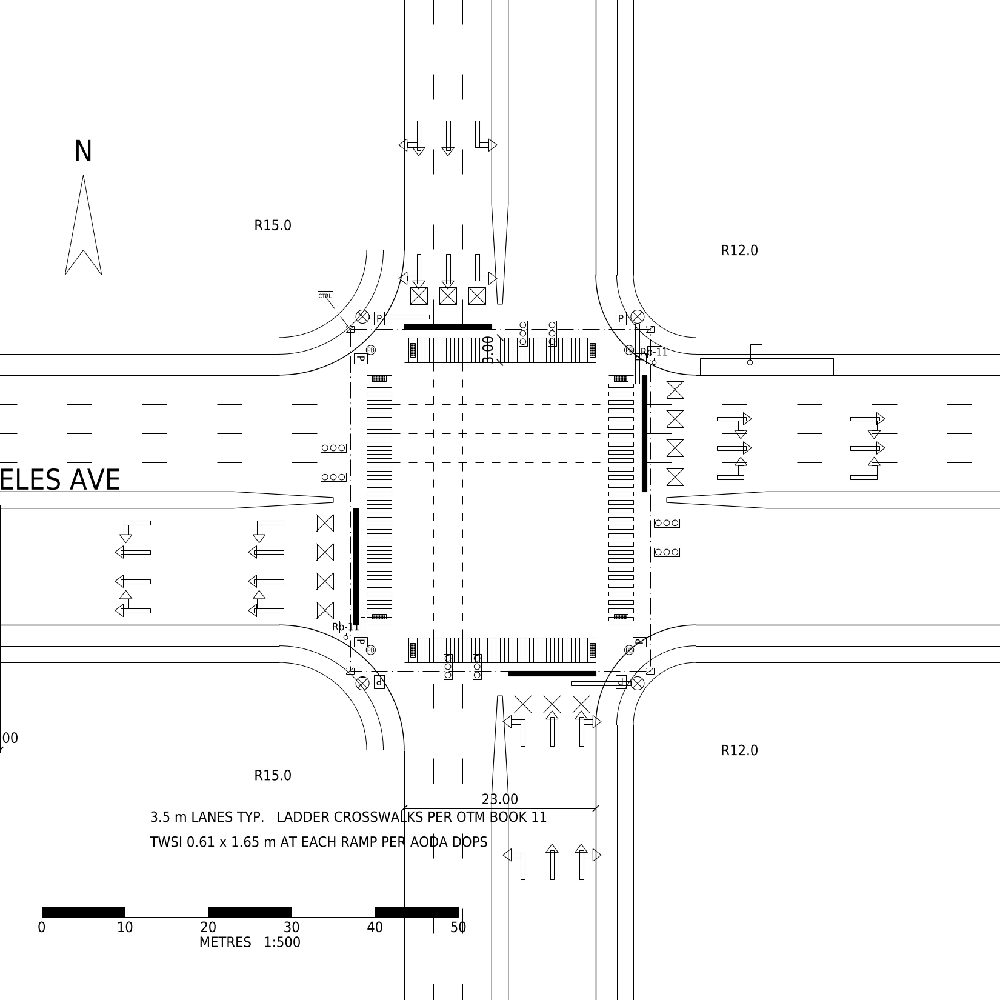
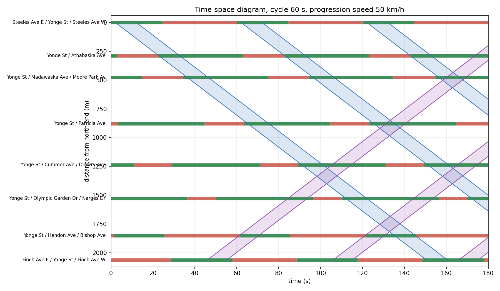
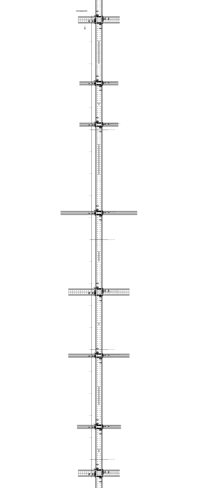

# Signalized intersection plan generator

Draws a complete signalized intersection plan as a DXF that opens in AutoCAD:
curbs and corner returns, sidewalks, lane markings, ladder crosswalks, stop bars,
lane-use arrows, signal heads and mast arms, pedestrian heads and pushbuttons,
curb ramps with tactile surfaces, loop detectors, conduit and junction boxes,
a transit stop, dimensions, and an A1 sheet with a title block at 1:500.

Everything is parametric, so changing the lane count or corner radius redraws
the whole intersection instead of forcing a manual edit.



## Why

Intersection base plans get redrawn from scratch constantly, and the geometry
is repetitive: half-widths follow from the lane count, crosswalks and stop bars
sit at fixed offsets from the curb line, and corner returns are fillets between
two perpendicular curb lines. That is a script, not drafting work. This one
produces a base you can drop an aerial photo behind and adjust to the real site.

## Use

```
pip install ezdxf
python intersection_plan.py -o output/intersection-plan.dxf
```

Lane movements drive the markings. Pass the movements each lane is allowed to
make, listed from the centreline outward, and the generator places the matching
arrow: a combined arrow on a shared lane, separate arrows on exclusive lanes,
two sets per approach in line with OTM practice.

```
python intersection_plan.py --lanes-n "l,t,t,tr" --lanes-e "l,t,t,r"
```

It also runs two checks: a receiving-lane check that warns when more lanes turn
into a leg than that leg can receive, and a through-alignment check that warns
when opposing approaches offer different numbers of through lanes, which forces
through traffic to shift lanes inside the intersection.

Corner radii can be set per corner (`--radius-nw` and so on) rather than one
value everywhere, and a raised median (`--median-ew`, `--median-ns`) takes width
out of the cross-section, with a tapered nose set back from the stop bar. Curb
ramps are centred on the crosswalk they serve so the pedestrian path runs
straight off the ramp, and stop bars sit on their own layer as solid bars.

Options:

```
--lanes-n/s/e/w      movements per lane, centreline outward, e.g. "l,t,t,tr"
--major-lanes        lanes per direction on the major street (default 3)
--minor-lanes        lanes per direction on the minor street (default 2)
--lane-width         metres (default 3.5)
--radius             corner radius, metres (default 12)
--crosswalk-width    metres (default 3.0)
--sidewalk-offset    curb face to sidewalk, metres (default 2.5)
--sidewalk-width     metres (default 2.0)
--leg                length of each approach drawn, metres (default 70)
--major-name         street name for the title block
--minor-name         street name for the title block
--no-transit-stop    omit the transit stop and landing pad
-o, --out            output path
```

A 5-lane by 3-lane intersection with tighter corners:

```
python intersection_plan.py --major-lanes 5 --minor-lanes 3 --radius 9 \
  --major-name "STEELES AVE W" --minor-name "YONGE ST"
```

## Drawing conventions

Model space is in metres, plotted 1:500 on A1. Text heights are set so that
annotation lands at 2.5 mm, 3.5 mm and 5.0 mm on paper.

Layers follow a `C-` discipline prefix: `C-CURB`, `C-MARK`, `C-MARK-LANE`,
`C-SGNL`, `C-SGNL-UG`, `C-SGNL-DET`, `C-PED`, `C-SIGN`, `C-TRAN`, `C-DIMS`,
`C-ANNO`. Reference imagery goes on `V-BASE`. The symbol palette sits on
`PALETTE`, off to the right of the drawing; delete that layer before plotting.

Broken lane lines use a 3 m dash with a 6 m gap. Crosswalks are ladder type,
3.0 m wide, set 1.5 m off the projected curb line, with stop bars 1.0 m behind
them. Tactile plates are 0.61 by 1.65 m. Dimensions come from TAC Geometric
Design Guide practice, OTM Book 11 for markings, OTM Book 12 for signals, and
the AODA Design of Public Spaces standard for ramps.

## Dashboard

`docs/index.html` is a self-contained page: move the cycle length and
progression speed and the offsets are re-optimized in the browser, with the
time-space diagram and band widths updating live. Enable GitHub Pages on the
`/docs` folder to publish it.

## Signal timing

`signal.py` builds a NEMA ring-barrier plan, allocates splits from critical
lane volumes, and computes HCM 6th control delay and level of service by
movement, approach and intersection. It compares timing alternatives:

```
python signal.py data/steeles_yonge_2026-06-30_raw.csv \
    config/steeles_yonge.json --period pm --compare
```

Splits sum to the cycle. Effective green is the split minus 4 s of lost time.
Protected-permitted lefts use a gap-acceptance estimate for the permitted
capacity rather than the full HCM permitted-phase procedure.

## Vissim

`vissim.py export` writes the model inputs from the same numbers the analysis
uses: peak hour volumes and turning fractions, pedestrian crossings, and one
fixed-time controller sheet per alternative.

`vissim.py compare` reads a node evaluation .att export and places simulated
delay and queue next to the HCM estimate, movement by movement, so the two
methods can be compared rather than reported separately.

## Corridor mode

`corridor.py` runs progression analysis across a string of signals: chainage
from the count coordinates, a common Webster cycle, splits from critical lane
volumes, and a local search over offsets that maximizes the smaller of the two
through bands. It writes a time-space diagram.

```
python corridor.py data/yonge_corridor_raw.csv corridor/yonge.json --period pm
```





`corridor_plan.py` draws the matching strip plan: each intersection placed at
its true chainage on a stationed baseline, link segments between them, match
lines every 500 m, and the timing results annotated beside each signal.

```
python corridor_plan.py data/yonge_corridor_raw.csv corridor/yonge.json \
    -o output/yonge-corridor.dxf
```

## Worked example

Yonge Street between Steeles and Finch, eight signals over 2.06 km, using
City of Toronto counts from May and June 2026. PM peak hour.

## Limits

The output is a base drawing, not a signed design. Corner radii are drawn as
simple fillets rather than three-centre curves, and there is no swept-path
check and no grading. Verify every dimension against the current standard and
the site before using any of it for real work.

Lane configurations in the config files are assumptions read off aerial
imagery, not surveyed. Saturation flow in the corridor module is a flat
per-lane value; the HCM adjustment factors live in `hcm.py` and are not yet
wired into the progression run. Splits come from a two-phase Webster estimate,
so any intersection running protected-permitted or lead-lag phasing is
misrepresented. Offsets are optimized for through bandwidth alone, which
ignores queue clearance and side-street delay. None of this is validated
against the operating agency's timing sheets, and Yonge at Steeles is a
boundary signal jointly operated with York Region.

## License

MIT

## Files

    intersection_plan.py   parametric DXF generator for one intersection
    corridor_plan.py       strip plan for a string of signals
    tmc.py                 peak hour, PHF and movement volumes from a Toronto count
    hcm.py                 HCM 6th saturation flow by lane group
    signal.py              ring-barrier phasing, control delay, LOS, alternatives
    corridor.py            common cycle, splits, offsets, progression bandwidth
    vissim.py              Vissim model inputs, and comparison of results to HCM
    write_inpx.py          writes network geometry straight into a Vissim .inpx
    build_vissim.py        builds the same model through the Vissim COM API

    config/                lane configuration per intersection
    corridor/              signal list for the corridor
    data/                  City of Toronto turning movement counts
    docs/                  the dashboard published through GitHub Pages
    output/                generated drawings, sheet and figures
    vissim/                model inputs, controller sheets and the build guide
